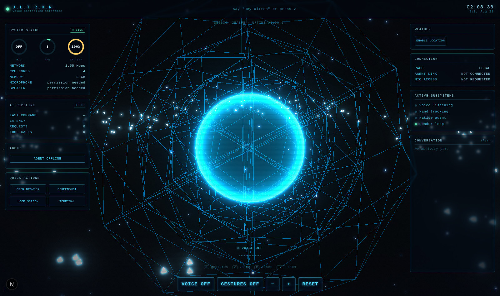

# ULTRON Orb UI

A holographic HUD orb built with **Next.js**, **Three.js**, and **MediaPipe** hand tracking — control it with your bare hands through your webcam, or by voice with a "Hey Ultron" wake word.



## Getting started

```bash
npm install
npm run dev
```

Open [http://localhost:3000](http://localhost:3000).

## Controls

### Mouse / touch

| Input | Action |
| --- | --- |
| Drag | Spin the orb |
| Scroll / pinch | Zoom in & out |

### Hand gestures (webcam)

Click **GESTURES OFF** (or press `G`) and allow camera access, then:

| Gesture | Action |
| --- | --- |
| Pinch (thumb + index) one hand and move it | Spin the orb |
| Pinch with **both** hands, spread apart / bring together | Zoom in / out |

### Keyboard

| Key | Action |
| --- | --- |
| `G` | Toggle hand gestures |
| `V` | Toggle voice control |
| `R` | Reset the view |
| `+` / `−` | Zoom in / out |

### Voice (wake word, like "Hey Siri")

Click **VOICE OFF** (or press `V`) and allow mic access. Ultron then listens
continuously in the background for a wake phrase, the same way "Hey Siri"
does — say it, then say a command:

> **"Hey Ultron, open Spotify"** · **"Hey Ultron, zoom in"** · **"Hey Ultron, reset view"**

| Say | Does |
| --- | --- |
| "open \<name\>" / "launch \<name\>" | Opens an app — natively via the [local agent](#opening-native-apps) if it's running, otherwise the web version in a new tab |
| "zoom in" / "zoom out" | Zoom the orb |
| "spin left" / "spin right" | Nudge-rotate the orb |
| "reset view" | Reset the camera |
| "gestures on" / "gestures off" | Toggle hand tracking |
| "lock the screen" / "sleep" | Lock or sleep the machine *(needs the agent)* |
| "shut down" / "restart" / "sign out" | Power actions *(needs the agent)* |
| "mute" / "volume up" / "volume down" | Volume *(needs the agent)* |
| "brightness up" / "brightness down" | Display brightness *(needs the agent)* |
| "play the music" / "skip song" / "previous track" | Media keys *(needs the agent)* |
| "turn on wifi" / "turn off bluetooth" / "dark mode" / "do not disturb" | System toggles *(needs the agent)* |
| "take a screenshot" / "empty trash" | *(needs the agent)* |
| "cancel" / "never mind" | Cancel the current command |
| anything else | Handed to Claude *(needs the agent + [Claude Code](#the-claude-brain))* |

System-level actions (marked *needs the agent* above) have no web
equivalent — a browser genuinely can't lock your screen or change your
volume, so those only work once the local agent below is running. See
[`agent/README.md`](agent/README.md) for the full ~75-entry allowlist
across apps, power, media, and system toggles, and how to add your own.

#### Opening native apps

A browser tab can't launch native applications on its own — no website can,
by design. To actually open apps on your machine (not just their web
versions), run the small local companion process:

```bash
npm run agent
```

It prints a one-time auth token; click **AGENT OFFLINE** in the HUD and
paste it in. See [`agent/README.md`](agent/README.md) for how it works and
its security model (localhost-only, token-authed, allowlisted apps only —
voice text is never run as a shell command).

#### The Claude brain

If a voice command doesn't match anything the parser recognizes, and the
agent is connected, it's handed to [Claude Code](https://claude.com/product/claude-code)
running locally — a fresh, non-interactive `claude -p` call per command,
authenticated however your `claude` CLI already is (a Pro/Max subscription
login works, no separate API key needed). The answer is spoken back through
your browser rather than shown in a panel, since there's no transcript UI.

Claude's only capability there is the same app-opening allowlist —
`Bash`/`Edit`/`Write`/`Read`/`WebFetch`/and the rest of Claude Code's
built-in tools are explicitly disallowed. That's deliberate: giving a
voice-triggered path real shell or file access would mean a misheard word
could execute arbitrary code on your machine, and no model's judgment is a
substitute for an allowlist there. See [`agent/README.md`](agent/README.md#the-claude-brain-optional-needs-claude-code)
for the full setup and reasoning.

## The dashboard

Around the orb sits a system dashboard — everything on it is either a real
value the browser genuinely exposes, or clearly marked as needing something
(mic permission, the local agent, location access) rather than faked:

| Panel | Shows |
| --- | --- |
| System status | Live gauges for mic input level, render FPS, and battery (where the browser exposes it); CPU core count, approximate network speed, and real mic/speaker device names once permission is granted |
| Agent | Connection state, plus the connected machine's platform and allowlist size once linked |
| Quick actions | One-click versions of common voice commands — disabled until the local agent is connected, since none of them have a sensible web fallback |
| Weather | Real current conditions via your browser's geolocation (opt-in — nothing is requested until you click) |
| Connection | Whether the page is served over HTTPS, whether the agent link is authenticated, and mic permission state |
| Active subsystems | Live on/off state of voice, hand tracking, the agent link, and the render loop |

There's deliberately no activity log, command history, or transcript of what
was heard — the dashboard shows live system/session state, not a running
record of input or conversation.

Weather uses two free, keyless APIs — [open-meteo.com](https://open-meteo.com)
for the reading and [bigdatacloud.net](https://www.bigdatacloud.com) to turn
your coordinates into a place name. Your location is sent only to those two
services for that one lookup; nothing is sent anywhere else, since this is a
static site with no backend of its own.

## How it works

- **`lib/orbScene.ts`** — the Three.js scene: a fresnel-shaded icosahedral
  core, nested tumbling wireframe cages, an instanced particle belt, a
  starfield, and a manual spherical camera rig driven by pointer drag/pinch
  and a bloom-only post-processing pass.
- **`lib/handTracker.ts`** — MediaPipe HandLandmarker running on the webcam
  feed. Continuous (not boolean) pinch-strength scoring with spring-damped
  smoothing and frame-debounced mode switching: one pinched hand spins the
  orb, two pinched hands zoom by spreading apart or together.
- **`lib/voiceControl.ts`** — Web Speech API wrapper: continuous listening,
  wake-word detection, auto-restart (browsers stop recognition after a pause),
  and a real-time mic-level meter via an `AnalyserNode`.
- **`lib/commandParser.ts`** — turns a heard phrase into a typed command.
- **`lib/webFallback.ts`** / **`lib/nativeAgent.ts`** — resolve "open X" to a
  web URL, or relay it to the local agent.
- **`lib/systemInfo.ts`** / **`lib/weather.ts`** — real, best-effort device
  telemetry (CPU/memory/network/battery/device labels) and opt-in weather.
- **`lib/speech.ts`** — speaks Claude's answers aloud (Web Speech Synthesis).
- **`agent/`** — the optional local companion process that can actually
  launch native apps (see above) and, via `claudeBrain.mjs` +
  `mcpServer.mjs`, hand unmatched commands to Claude Code, scoped to that
  same app-opening allowlist and nothing else.
- **`components/JarvisOrb.tsx`** — the HUD and glue between the scene, the
  tracker, voice control, and your inputs.

## License

MIT
